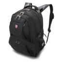
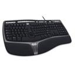

# Domain Adaptation Tutorial for the MAX78000

## Table of Contents
1. [**Context**: what is domain adaptation?](#context)
2. [**Overview**: what does this tutorial cover?](#overview)
3. [**Step 1: Pretraining** (optional): pretrain the model on unlabled data](#step-1-pretraining)

---

## Context
CNN models have been very successful at image classification tasks when trained on large labeled datasets. However, when deploying these CNN models on real systems (i.e. the MAX78000) for live inference, the model accuracy can drop significantly due to differences in the data distribution seen at test time and at training time. For example, the training data might be high quality images with good lighting while data seen during inference might be coming from a low quality sensor or an environment with variable conditions.  

A few examples of this *domain shift* are shown below where the ***source** domain* represents images from a dataset and the ***target** domain* represents images from the MAX7800's onboard camera. As shown, images from the target domain may be lower quality, noisy, have diferent backgrounds, and have different object orientation and aspect ratio.

| | Mug | Backpack | Monitor | Keyboard |
| :----: | :----: | :----: | :----: | :----: |
| **Source** Domain |  |  |  |  |
| **Target** Domain |  |  |  |  |

In general, the task of adapting a model trained in some ***source** domain* to a semantically similar but different ***target** domain* is referred to as **domain adpatation**.

---

## Overview
This tutorial will cover how to potentially improve the *live inference* accuracy of an image classification model using a technique called **Few-Shot Adversarial Domain Adaptation** which will be referred to as *FADA* ([see the paper here](https://arxiv.org/pdf/1711.02536.pdf)).

Often a trained model will get > 95% accuracy on the test set but completely fail or not work very well once synthesized onto the MAX78000 due to the *domain shift* explained in [the context section](#context). A straightforward and effective solution to this problem would be to collect a large labeled dataset from the target domain and train the model on this custom dataset. However, large scale data collection and labeling requires a lot of time and effort and may not be straightforward without a proper setup for saving the images. 

FADA on the other hand is a method that can adapt a model trained on a source dataset using only 10 to 20 images per class from the target domain. This way only around 100 to 200 images (depending on the number of classes) need to be collected and labeled rather than thousands. A high level flowchart of the steps involved is shown below.

At the minimum, only one extra step is added to the standard training workflow which is shown by the yellow box. However, better results can potentially be achieved by applying the optional steps as well. The rest of the tutorial will show step by step how to apply FADA to an actual application using a Jupyter notebook.

---

## Step 1:Pretraining